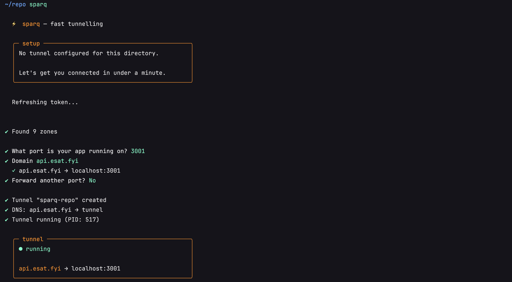
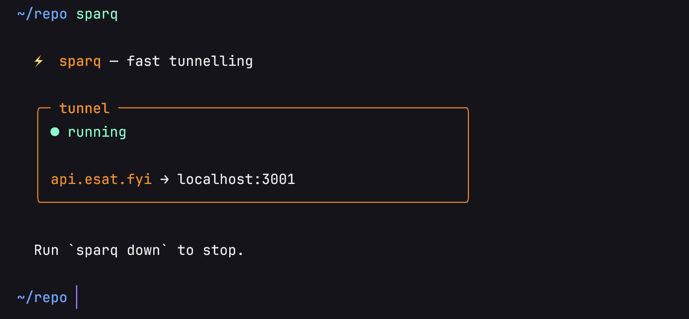
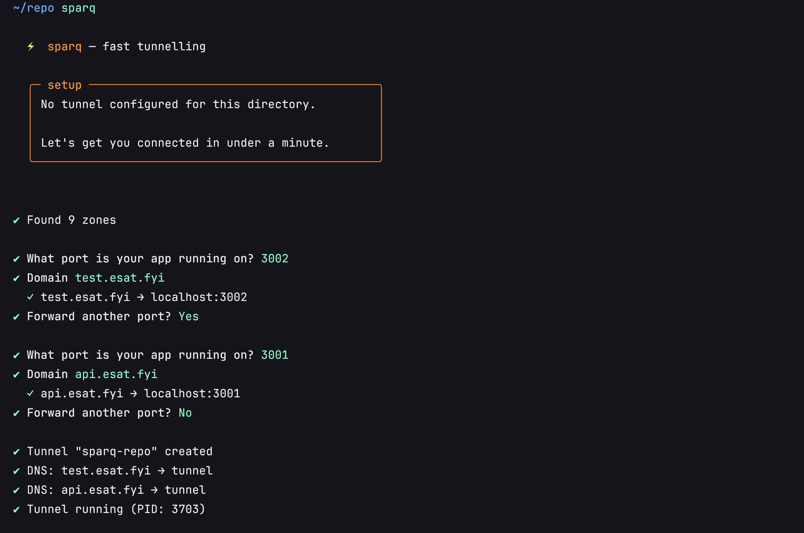

<h1 align="center">⚡ sparq</h1>

<p align="center">
  <strong>Cloudflare Tunnels, simplified.</strong><br/>
  Expose your local dev server to the internet in one command.
</p>

---

## What is sparq?

sparq is a CLI that manages Cloudflare Tunnels for you. It creates tunnels, sets up DNS records, and runs the daemon. Run `sparq` in your project directory and get a permanent public URL on your own domain.

<p align="center">
  
</p>

Next time you run `sparq`, it starts the tunnel instantly — no setup needed.

<p align="center">
  
</p>

## Install

```bash
npm i -g trysparq
```

## Quick start

```bash
# First time: authenticates, creates tunnel, sets up DNS, starts it
sparq

# After that, just start/stop
sparq        # start
sparq down   # stop
```

You'll need a [Cloudflare account](https://dash.cloudflare.com/sign-up) with at least one domain added.

## Commands

| Command | Description |
|---|---|
| `sparq` | Start tunnel (or run setup wizard on first use) |
| `sparq up` | Alias for `sparq` |
| `sparq down` | Stop the tunnel |
| `sparq status` | Show tunnel state, routes, and PID |
| `sparq add` | Add another hostname → port route |
| `sparq rm <host>` | Remove a route and its DNS record |
| `sparq ls` | List all sparq-managed tunnels across projects |
| `sparq logs` | Show tunnel logs (`-f` to follow) |
| `sparq login` | Authenticate with Cloudflare |
| `sparq logout` | Remove stored credentials |
| `sparq import [path]` | Import config from another directory |
| `sparq destroy` | Permanently delete tunnel, DNS records, and all config |

## How it works

sparq manages two layers of Cloudflare auth automatically:

1. **OAuth** — for listing your domains and account info
2. **cloudflared cert** — for creating tunnels and DNS routes

Both are browser-based, one-time flows. After that, sparq handles everything:

- Creates a named Cloudflare Tunnel for your project
- Points your chosen subdomain → tunnel via CNAME
- Generates a `cloudflared` config and runs it as a background daemon
- Stores project config in `.sparq/` and credentials securely in `~/.sparq/`

Each project gets its own tunnel. Run `sparq ls` from anywhere to see them all.

## Multi-route support

Forward multiple local ports through one tunnel:

<p align="center">
  
</p>

## Requirements

- **Node.js** >= 20
- **Cloudflare account** with at least one active domain
- **cloudflared** — sparq installs this automatically if missing

## License

MIT
